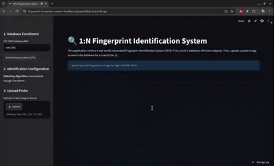

# Automated Fingerprint Identification System (AFIS)

A Python-based biometric identification engine that extracts minutiae features from raw fingerprint scans and performs highly accurate 1:N database matching using Generalized Hough Transform spatial alignment.

---
## 👁️ System in Action



---
##  Tech Stack
*   **Language:** Python 3.x
*   **Computer Vision & Image Processing:** OpenCV, scikit-image, Pillow
*   **Frontend & Deployment:** Streamlit, Streamlit Community Cloud
*   **Data Management:** Pickle (Serialization)
---
##  Quick Start
Clone the repository, install the dependencies, and launch the local Streamlit environment.

```bash
git clone [https://github.com/yourusername/fingerprint-recognition-system.git](https://github.com/yourusername/fingerprint-recognition-system.git)
cd fingerprint-recognition-system
pip install -r requirements.txt
streamlit run app.py
```
##  Engineering Decisions & Learnings
Transitioning this system from an academic algorithm into a deployable, persistent web application required addressing strict bottlenecks in memory management, algorithmic accuracy, and dependency resolution.
### 1. Combating "Raw Count Bias" with Score Normalization
Initially, the Generalized Hough Transform calculated match similarity based entirely on the absolute count of overlapping minutiae. This created a critical flaw: noisy, highly dense gallery prints were artificially outscoring genuine matches simply through statistical probability. By normalizing the match score as a percentage of the _minimum_ available minutiae between the probe and gallery arrays, the system successfully filters out dense background noise and relies strictly on the geometric quality of the spatial overlap.
### 2. State Persistence over Real-Time Processing
Processing the FVC 2000 database consisting of complex `.tif` compression formats is computationally expensive. Executing the full extraction pipeline (segmentation, normalization, Gabor filter enhancement, binarization, and skeletonization) on every server boot caused massive latency and out-of-memory risks. To resolve this, the architecture was shifted to an offline-enrollment model. The system extracts spatial coordinates and orientations once, serializes the resulting object arrays via Python's `pickle` library, and loads the lightweight binary file into memory on startup. This ensures the application remains highly responsive and persistent on cloud infrastructure without constantly re-processing image data.

### 3. Bypassing Headless Cloud GUI Crashes
Deploying OpenCV on stripped-down Linux containers (like Streamlit Community Cloud or Dockerized PaaS instances) frequently results in fatal `import cv2` crashes. While `opencv-python-headless` is the standard fix, secondary dependencies (like `fingerprint_enhancer`) often silently force the re-installation of the GUI-bound package. Diagnosing this required dropping down to the OS level and utilizing a `packages.txt` file to manually inject Ubuntu C++ graphics drivers (`libgl1`, `libglib2.0-0`) directly into the container environment prior to the Python build step.

##  Future Scope
- **Engine Rewrite:** Port the core Generalized Hough Transform matcher into C/C++ to gain lower-level memory control and drastically increase execution speed.
- **Scalable Architecture:** Migrate the serialized `.pkl` database to a dedicated vector database or spatial search engine to support identification scaling to millions of records.

##  Project Structure
- `app.py`: Streamlit frontend interface and database session management.
- `core/fingerprint.py`: The biometric extraction pipeline (Gabor enhancement, skeletonization, minutiae extraction).
- `core/matchers.py`: The geometric alignment algorithms (Generalized Hough Transform).
- `data/DB1/`: Directory for the FVC 2000 dataset.